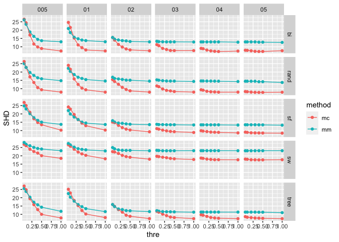
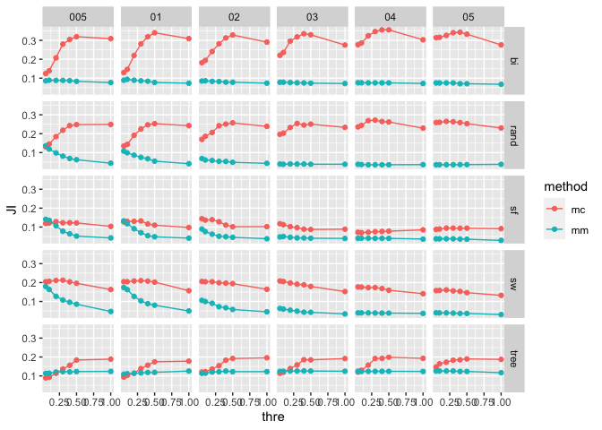
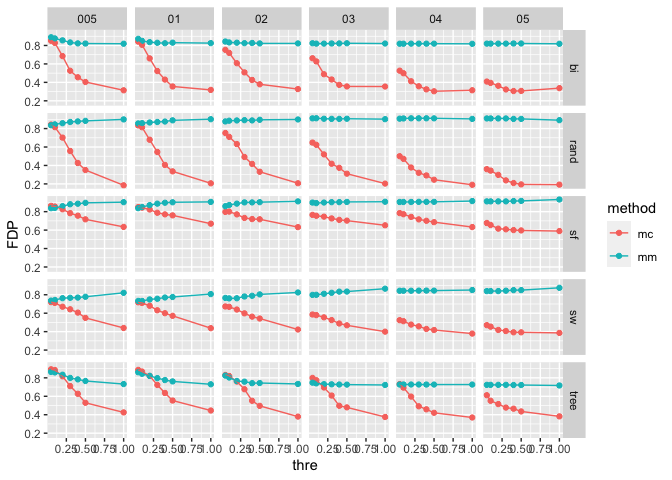

Tuning Parameter Selection
================

## Two important elements

1.  Size of *λ**m**i**n* = *λ**m**a**x* ⋅ *ε*
2.  Size of threshold (*γ*) where
    *k* = sup {*k*∣*d**r**k*\>*γ*⋅max*q**d**r**q*, *k*∈*K*}

## Found Possible issues

1.  I have used *ε* = 0.05, but it tends to estimate too many edges.
2.  I also have used *γ* = 0.3, and it still provides a lot of edges,
    consequently, bad evaluation results.

## Check up many possible cases

1.  Simulation setting

-   Graph type: Bipartite, Random DAG, Small-World, Scale-Free, Tree
-   10 edges (6 continuous + 4 multinomial nodes)
-   3 of continuous nodes are discretized as categorical variables.
-   “mc” used the origianl data (sort of ‘Oracle case’), “mm” used the
    discretized data.
-   100 iterations
-   *ε* = (0.05,0.1,0.2,0.3,0.4,0.5)
-   *γ* = (0.05,0.1,0.2,0.3,0.4,0.5,1)

2.  SHD cases

<!-- -->

3.  JI cases

<!-- -->

4.  FDP cases

<!-- -->

## What’s next?

1.  When *γ* or *ε* gets larger, SHD tends to decrease, but JI (Large is
    better) also decreases, too. JI seems to have its peak among the all
    the value of thresholds (*γ*).  
2.  Need to find out the possible optimal point.
